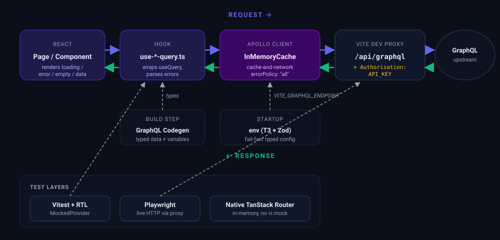

<div align="center">


# PayDash

**Payment analytics dashboard built on a GraphQL backend**
React 19 · Vite 6 · Apollo · TanStack Router · Tailwind v4

<p>
  
  
  
  
  
  
  
  
</p>

</div>

---

## Design decisions

### Architecture

| Choice | Why | Tradeoff |
|---|---|---|
| **Apollo Client** over `graphql-request` | Normalized cache lets the dashboard KPIs and the payments list share `charges` entries. Per-hook `errorPolicy: "all"` + `fetchPolicy: "cache-and-network"` keep partial data on screen during refetches. | ~40 KB heavier than `graphql-request`; accepted for the cache, reactive updates, and DevTools. |
| **GraphQL Codegen** (`client-preset` + `near-operation-file`) | Hook signatures and `variables` types track the live schema; `*.generated.ts` sits next to each operation, so deleting a hook removes its types. | Adds a `codegen` step and commits generated files. Beats hand-rolled interfaces that silently drift. |
| **Vertical slices** (`src/<feature>/`) | Each feature (`analytics`, `payments`) owns its hooks, components, skeletons, generated types, and tests in one folder. Deleting a feature = `rm -rf src/<feature>/`. | Some cross-feature duplication vs a layered `components/hooks/services/` split. For a 2-feature surface, ownership wins. |
| **Biome** for lint + format | One binary, one config; replaces ESLint + Prettier + the `eslint-*` plugin tree. Fast enough to run on every save. | Smaller rule ecosystem than ESLint; we lose a few niche plugins, none needed here. |
| **`@t3-oss/env-core` + Zod** | `VITE_GRAPHQL_ENDPOINT` is parsed as a URL at startup — failures show a typed message instead of a runtime `undefined is not a URL`. | One tiny dep and a schema file. |
| **TanStack Router** (file-based) | Routes are typed end-to-end; `routeTree.gen.ts` powers IDE autocomplete on `<Link to=...>` and `useParams()`. | Adds `tsr generate` to `prebuild`. React Router would be lighter on tooling, heavier on runtime config. |

### Library picks (smaller calls)

- **shadcn/ui** — copy-paste Radix primitives owned by the repo; no version-locked npm dep. *Tradeoff:* no auto-upgrade — we own the diff.
- **Recharts** — declarative React API; integrates cleanly with shadcn theming. *Tradeoff:* heavier than tiny chart libs, fine for a few dashboard charts.
- **decimal.js** — cents → display conversion in `src/shared/lib/currency.ts` to avoid IEEE-754 surprises. *Tradeoff:* explicit `Decimal(...)` at the boundary instead of native arithmetic.
- **date-fns** — tree-shakeable; lighter bundle than moment. *Tradeoff:* more imports than a single `dayjs` instance.
- **Vitest + RTL** for unit/behavior, **Playwright** for E2E through the real Vite proxy. *Tradeoff:* two test runners to keep green, because they catch different bugs.

### Assumptions

- `API_KEY` must never reach the browser. Enforced by injecting it from the Vite dev-server proxy; no `VITE_`-prefixed env contains it.
- The API returns amounts as integer cents; we coerce to `Decimal` at render boundaries (`src/shared/lib/currency.ts`).
- Single-locale (en-US) date and currency formatting is acceptable for v1; full i18n is out of scope.

---

## End-to-end flow

<p align="center">
  
</p>

A page calls its per-slice **hook** (`use-*-query.ts`) — the hook wraps Apollo's `useQuery` and parses errors into a friendly message. **Apollo Client** holds the normalized cache and follows `cache-and-network` + `errorPolicy: "all"` (so partial data still renders). On dev, requests go to `/api/graphql`, which the **Vite proxy** rewrites onto the upstream **GraphQL API** with an `Authorization: API_KEY` header that never reaches the browser bundle.

**GraphQL Codegen** feeds typed `data` + `variables` into every hook at build time. **T3-env + Zod** validates `VITE_GRAPHQL_ENDPOINT` at startup. **Vitest + RTL** swap Apollo with `MockedProvider` for unit/behavior tests; **Playwright** hits the real path through the Vite proxy.

---

## Quick start

```bash
cp .env.example .env       # fill API_KEY + VITE_GRAPHQL_ENDPOINT
npm install
npm run codegen            # generate GraphQL types
npm run dev                # http://localhost:5173
```

### Environment

| Var | Scope |
|---|---|
| `API_KEY` | **Server-only** — injected by the Vite dev proxy, never bundled into client JS |
| `VITE_GRAPHQL_ENDPOINT` | Client; validated at startup via Zod (`@t3-oss/env-core`) |

---

## Stack

- **React 19** + **TypeScript 5.8** + **Vite 6**
- **Apollo Client 3.13** + **GraphQL Code Generator** (`client-preset` + `near-operation-file`)
- **`@0no-co/graphqlsp`** — TS LSP plugin for inline `graphql(\`…\`)` autocomplete + schema validation
- **TanStack Router** (file-based) + **`routeTree.gen.ts`**
- **Tailwind CSS v4** + **shadcn/ui** + **Recharts**
- **Biome 2.4** for lint + format (replaces ESLint + Prettier)
- **Vitest** + **React Testing Library** + Apollo `MockedProvider`
- **Playwright** (chromium) for E2E
- **`@t3-oss/env-core`** + **Zod** for typed env

---

## Scripts

| Command | What |
|---|---|
| `dev` / `build` / `preview` | Vite |
| `typecheck` | `tsc --noEmit` |
| `codegen` / `codegen:watch` | GraphQL types |
| `lint` / `format` / `check` / `check:fix` | Biome |
| `test` / `test:watch` / `test:ui` | Vitest — 27 tests |
| `test:e2e` / `test:e2e:ui` / `test:e2e:report` | Playwright — 2 specs |

Run both test layers:

```bash
npm run test && npm run test:e2e
```
